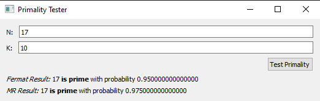
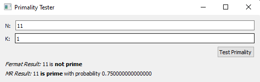

# Project 1
The purpose of this project is to get you up and running with Python. You will also gain experience with algorithms for modular arithmetic. In this project, 
you will implement a prime number test based on Fermat's little theorem and the Miller-Rabin conditions.
## Installation
In order to run the program, simply fork the repository and install the three Python files Proj1GUI.py, fermat.py, and which_pyqt.py. These three files can 
be placed in whatever directory you wish.</br> This project uses [PyQt5](https://pypi.org/project/PyQt5/) in order to build the GUI for the application. Assuming you have
installed [Python](https://www.python.org/downloads/) and your PATH variable is set up properly to run Python commands from the terminal, use the following command to install PyQt5:
```bash
$ pip install PyQt5
```
After the project has been downloaded, simply run:
```bash
$ python ProjGUI.py
```
To launch the application.
## Usage
To use the application, simply input a Number N and a value k. N represents the number you wish to test the primality of, and k represents the number of times you
would like to iterate the test. You should notice that composite numbers are always correctly identified, but prime numbers are sometiems misidentified especially
with lower k values. 



Here we can see that 17 if very likely prime thanks to the number of iterations k we performed on the number.



Here, 11 got past the test for the Fermat equation because not enough iterations of the algorithm were tried, thus the probability for determining if it was 
prime was lower.

## Experimentation 
In order to test the code, various inputs with various k iteration values were entered over and
over. First I tested composite numbers over and over to see if the test somehow slipped up and
said one of them was prime. However the test was able to identify a composite number 100% of
the time without variance from the k value. 
</br></br>
Next, I needed to test prime numbers, so I entered prime numbers into the program starting off
with large k values like 20 - 10. This showed that the program very reliably correctly identified
the number was prime with very few cases of it misidentifying usually from the Fermat Test. 
</br></br>
Then when lowering the amount of iterations drastically to 1 or 2, the program became much less
consistent with identifying prime numbers correctly. Of course the Fermat algorithm failed more
often, but not by a very large margin. This showed to me the algorithms were implemented
correctly and were operating as expected.

## Time and Space Complexity
Modular Exponentiation: 
```python
if y == 0:                  # This is a single check so O(1)
    return 1
  
z = mod_exp(x, y // 2, N)   # Here, recursion is occurring at most log N times
                            # so we get O(log n)
if y % 2 == 0:              # modulus / multiplication occur as many times as
    return (z ** 2) % N     # many times as recursion calls, so O(log n)
else:
    return x * (z ** 2) % N
```
This shows a time complexity of O(log n) since the function recursively calculates log N steps.
The space complexity is O(n log n) because it needs to hold memory for the size of the input N
plus each recursive call.
</br></br>
Fermat's Theorem:
```python
if N == 1 or N == 4:                    # this is a simple O(1) call
    return 'composite'
elif N == 2 or N == 3:
    return 'prime'
Else:                                   # The loop is called k times, so
    for i in range(k):                  # O(k) or O(n)
        a = random.randint(2, N - 2)    # simple O(1)
        if mod_exp(a, N - 1, N) == 1:   # We know the function will take                                  
            return 'prime'              # O(log N) time to finish
return 'composite'
```
Because we have a function that requires O(log n) time inside a loop of k iterations, the time
complexity total will be O(k log n), or O(n log n). a will be created k number of times and we
know that the function requires O(n log n) memory, so compounded the space complexity is
O(n log n).
</br></br>
Miller Rabin Theorem:
```python
d = N - 1
while (d % 2 == 0):                   # O(log n)
    d //= 2
    for i in range(k):                # O(k) or O(n)
        a = random.randint(2, N - 2)
        x = mod_exp(a, d, N)          # O(log n)
        if (x == 1 or x == N - 1):    # O(1)
            return 'prime'
        while (d != N - 1):           # O(log n)
            x = (x * x) % N
            d *= 2
            if (x == 1):
                return 'composite'
            if (x == N - 1):
                return 'prime’
        return 'composite'
```
The miller rabin algorithm has more lines of code, but when compounded together to find the
time complexity, we are still left with O(n log n). This is due to having an O(log n) algorithm
nested inside a loop of O(n) iterations. The space complexity is similar to the Fermat test and
won’t exceed O(n log n) space as well. The loop creating a base ‘a’ each time compounded with
the function gives us that value.
</br></br>
## Algorithms For Complexity
Fermat: for n, if n = a composite integer then at least of all gcd(a, n) are fermat witnesses. We
can show this by
</br></br>
(a * b) ^ N - 1 ≣ a ^ N - 1 * b ^ N - 1 ≣ a ^ N - 1 !≣ 1 mod N
</br></br>
So basically there is a one-to-one mapping of values that pass and fail the test in the set of N -1.
Therefore, the probability of a test passing with the Fermat algorithm is 1 / (2 * k). The
probability gets exponentially smaller with extra iterations.
